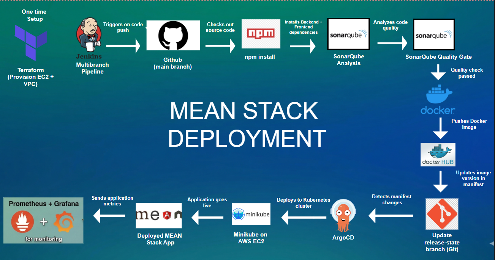


# 📌 Pre-Requisites

## 🏗️ Infrastructure Setup

> You can provision the EC2 instance automatically using the Terraform files provided in the `Terraform/` folder instead of creating it manually.

## ⚡ Quick Start with Terraform

### Prerequisites
- Terraform installed on your local machine
- AWS CLI configured with your credentials

### Steps

**Step 1 — Navigate to Terraform folder**
```bash
cd Terraform/
```

**Step 2 — Create `terraform.tfvars` file**

> ⚠️ You must create this file before running terraform commands!
```bash
touch terraform.tfvars
```

Add your custom values:
```hcl
# terraform.tfvars

# AMI Image ID (Ubuntu)
ami_value = "<image-id>"

# AWS Key Pair Name
key_file = "your-key-pair-name"

# EC2 Instance Type
type = "m7i-flex.large"

# VPC CIDR Block
cidr_block_vpc = "10.0.0.0/1"

# Subnet CIDR Block
cidr_block_subnet = "10.0.1.0/24"
```

**Step 3 — Initialize Terraform**
```bash
terraform init
```

**Step 4 — Preview infrastructure**
```bash
terraform plan
```

**Step 5 — Create EC2 instance**
```bash
terraform apply
```

**Step 6 — Destroy EC2 instance (when done)**
```bash
terraform destroy
```

> ⚠️ Make sure to run `terraform destroy` after you are done to avoid unnecessary AWS charges!
> 

## 🐳 Install Docker

**Step 1 — Install Docker**
```bash
sudo apt update
sudo apt install -y docker.io
```

**Step 2 — Add user to Docker group**
```bash
sudo usermod -aG docker $USER
newgrp docker
```

**Step 4 — Verify Installation**
```bash
docker --version
```

---

# ☕ Install Java (JDK 17)

```bash
sudo apt update
sudo apt install openjdk-17-jre -y
```

Verify:

```bash
java -version
```

---

# 🔧 Install Jenkins

## Add Jenkins repository

```bash
sudo wget -O /etc/apt/keyrings/jenkins-keyring.asc https://pkg.jenkins.io/debian-stable/jenkins.io-2026.key
echo "deb [signed-by=/etc/apt/keyrings/jenkins-keyring.asc] https://pkg.jenkins.io/debian-stable binary/" | sudo tee /etc/apt/sources.list.d/jenkins.list > /dev/null
```

## Install Jenkins

```bash
sudo apt update
sudo apt install jenkins -y
```

Open:

```
http://<EC2-IP>:8080
```

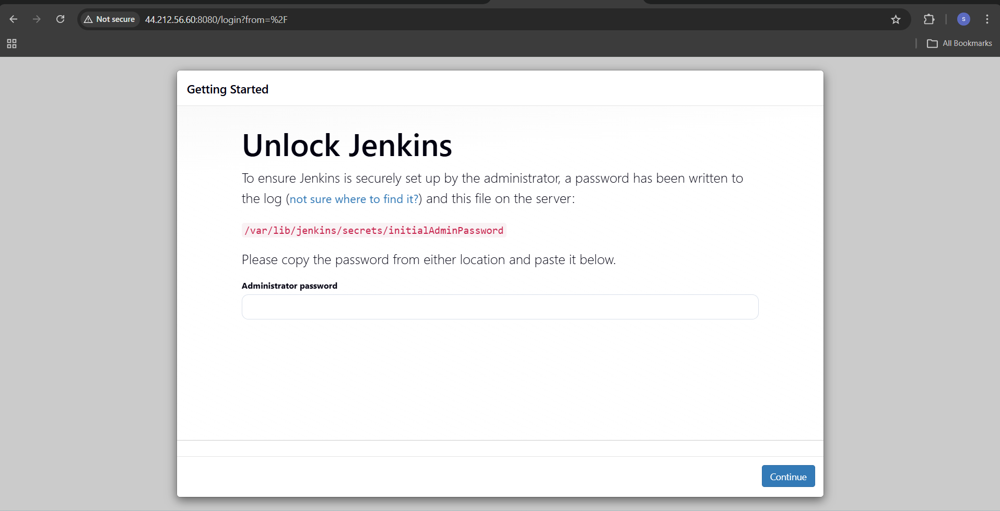


# 🔑 Get Jenkins Admin Password

```bash
sudo cat /var/lib/jenkins/secrets/initialAdminPassword
```
---

# 🔓 Give Jenkins Docker Access

```bash
sudo usermod -aG docker jenkins
```

---

---

# Jenkins Plugins you need to run this project
1. Docker Pipeline
2. Sonarqube Scanner

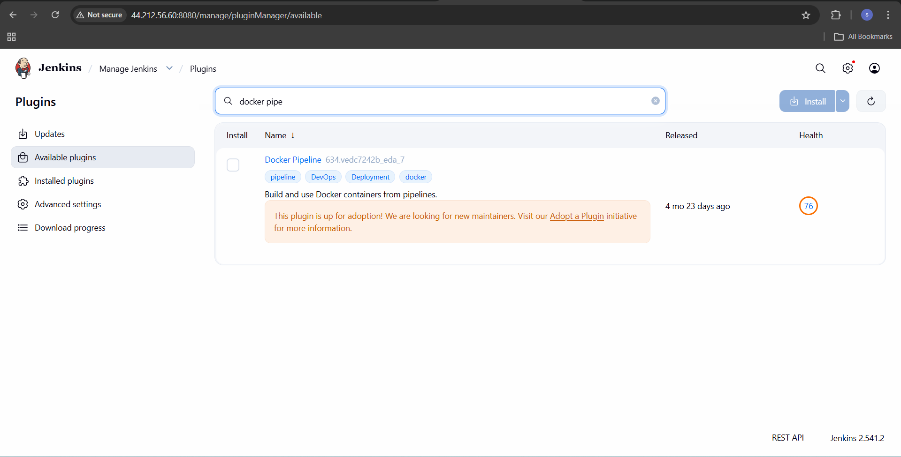
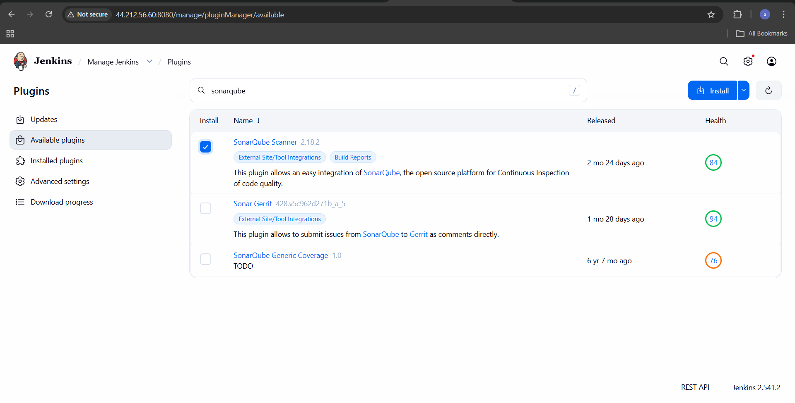

# Authentication you need to add in jenkins as credential
1. Dockerhub as Username and Password
2. Github as Username and Password
3. Sonarqube as Secret Text

You Need to give these permission to your github token:

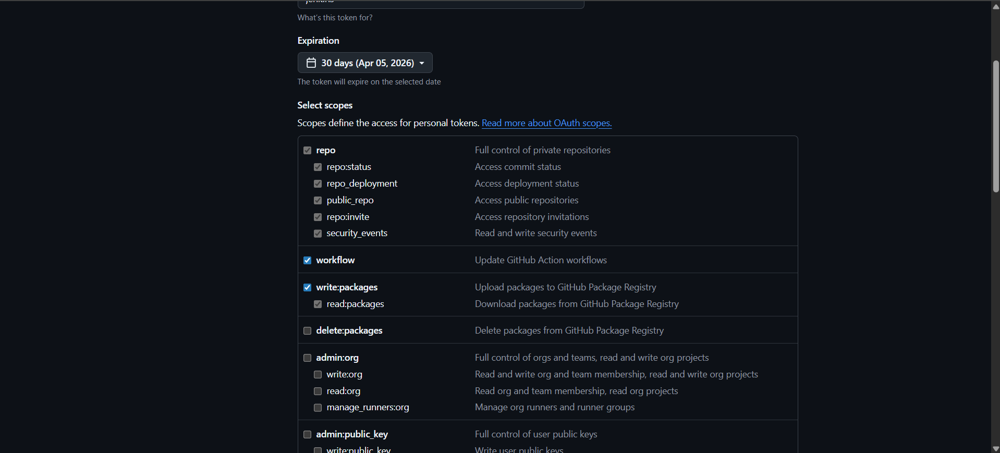


# 🔀 Configure Multibranch Pipeline

## Step 1 — Create New Item
```
Jenkins → New Item
→ Enter name: <pipeline-name>
→ Select: Multibranch Pipeline
→ Click OK
```

## Step 2 — Configure Branch Sources
```
Branch Sources → Add Source → GitHub
→ Credentials: select your github credential
→ Repository HTTPS URL: https://github.com/<your-username>/<your-repo>
→ Click Validate ✅
```

## Step 3 — Discover Branches
```
Behaviours → Add → Filter by name (with regular expression)
→ Regular Expression: main
```

> ⚠️ This ensures Jenkins only watches `main` branch and ignores `release-state`

## Step 4 — Build Configuration
```
Build Configuration
→ Mode: by Jenkinsfile
→ Script Path: Jenkinsfile
```

## Step 5 — Scan Repository Triggers
```
Scan Repository Triggers
→ Periodically if not otherwise run
→ Interval: 1 minute
```

## Step 6 — Save and Scan
```
→ Click Save
→ Click Scan Repository Now
→ Jenkins will find main branch
→ Creates job for main only ✅
```

## How it works
```
Push to main          → Jenkins builds ✅
Push to release-state → Jenkins ignores ✅
No infinite loop!     ✅
```

# 🔔 GitHub Webhook → Jenkins

In your repo on GitHub:

```
Settings → Webhooks → Add webhook
```

Fill:

```
Payload URL: http://<EC2-IP>:8080/github-webhook/
Content type: application/json
Events: Just the push event
```


# 📊 Install SonarQube

## Create user

```bash
sudo adduser sonarqube
```

## Download & Setup

```bash
cd /opt
sudo wget https://binaries.sonarsource.com/Distribution/sonarqube/sonarqube-10.4.1.88267.zip
sudo apt install unzip -y
sudo unzip sonarqube-10.4.1.88267.zip
sudo mv sonarqube-10.4.1.88267 sonarqube
sudo chown -R sonarqube:sonarqube /opt/sonarqube
```

---

## Create SonarQube Service

```bash
sudo nano /etc/systemd/system/sonarqube.service
```

Paste:

```ini
[Unit]
Description=SonarQube service
After=syslog.target network.target

[Service]
Type=forking
ExecStart=/opt/sonarqube/bin/linux-x86-64/sonar.sh start
ExecStop=/opt/sonarqube/bin/linux-x86-64/sonar.sh stop
User=sonarqube
Group=sonarqube
Restart=always
LimitNOFILE=65536
LimitNPROC=4096

[Install]
WantedBy=multi-user.target
```

---

## Start SonarQube

```bash
sudo systemctl daemon-reload
sudo systemctl enable sonarqube
sudo systemctl start sonarqube
sudo systemctl status sonarqube
```

Open:

```
http://<EC2-IP>:9000
```

# 🔑 Get Sonarqube Password

```bash
username : admin
password : admin
```

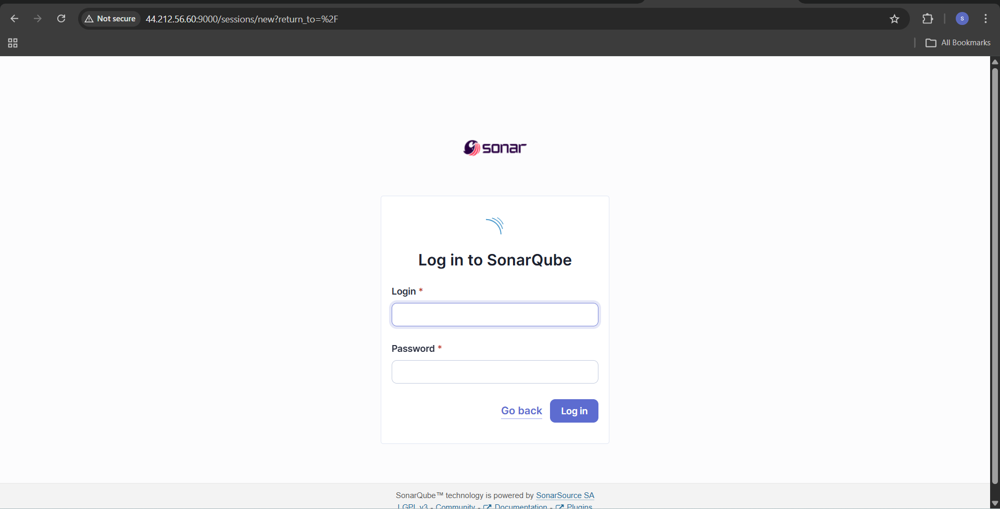

---

After this, you can give your own password.

# 🟢 Install Node.js 18

```bash
curl -fsSL https://deb.nodesource.com/setup_18.x | sudo -E bash -
sudo apt install nodejs -y
```

Verify:

```bash
node -v
npm -v
```

---

# 🔍 Install Sonar Scanner

## Step 1 — Download and Install
```bash
wget https://binaries.sonarsource.com/Distribution/sonar-scanner-cli/sonar-scanner-cli-5.0.1.3006-linux.zip
unzip sonar-scanner-cli-5.0.1.3006-linux.zip
sudo mv sonar-scanner-5.0.1.3006-linux /opt/sonar-scanner
```

## Step 2 — Create Symlink
```bash
sudo ln -s /opt/sonar-scanner/bin/sonar-scanner /usr/local/bin/sonar-scanner
```

## Step 3 — Verify Installation
```bash
# verify for ubuntu user
sonar-scanner --version

# verify for jenkins user
sudo -u jenkins sonar-scanner --version
```

# 🔗 SonarQube → Jenkins Webhook

In SonarQube:

```
Administration → Configuration → Webhooks → Create
```

Add:

```
Name: jenkins
URL: http://<EC2-IP>:8080/sonarqube-webhook/
```

---

# 🔗 Configure SonarQube in Jenkins

```
Manage Jenkins → System → SonarQube Servers
```

Add:

```
Name: SonarQube
Server URL: http://<EC2-IP>:9000
Token: <your-token>
```

---

# ✅ After completing all steps and creating pipeline configuration :


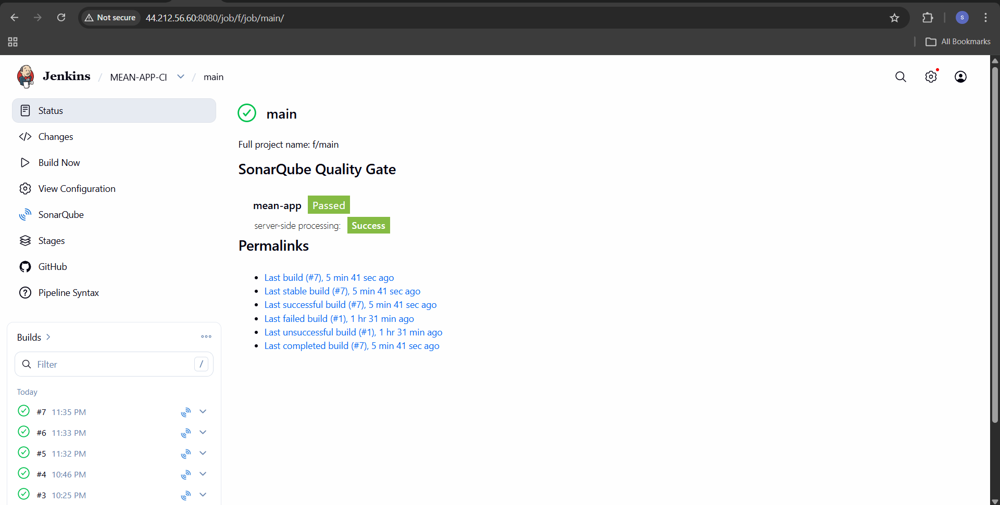


# 🚀 Install and Configure ArgoCD

# 📌 Pre-Requisites

- kubernetes cluster
- kubectl

## Step 1 — Create ArgoCD Namespace and Install
```bash
kubectl create namespace argocd
kubectl apply -n argocd --server-side --force-conflicts -f https://raw.githubusercontent.com/argoproj/argo-cd/stable/manifests/install.yaml
```

## Step 2 — Wait for Pods to be Ready
```bash
kubectl get pods -n argocd -w
```

## Step 3 — Change ArgoCD Server to NodePort
```bash
kubectl patch svc argocd-server -n argocd -p '{"spec": {"type": "NodePort"}}'
```

## Step 4 — Get ArgoCD Admin Password
```bash
kubectl -n argocd get secret argocd-initial-admin-secret \
  -o jsonpath="{.data.password}" | base64 -d
```

## Step 5 — Port Forward ArgoCD Service
```bash
nohup kubectl port-forward -n argocd service/argocd-server 8050:80 --address 0.0.0.0 > port.log 2>&1 &
```

## Step 7 — Access ArgoCD UI
```
http://<EC2-PUBLIC-IP>:8050

Username: admin
Password: <output from Step 4>
```

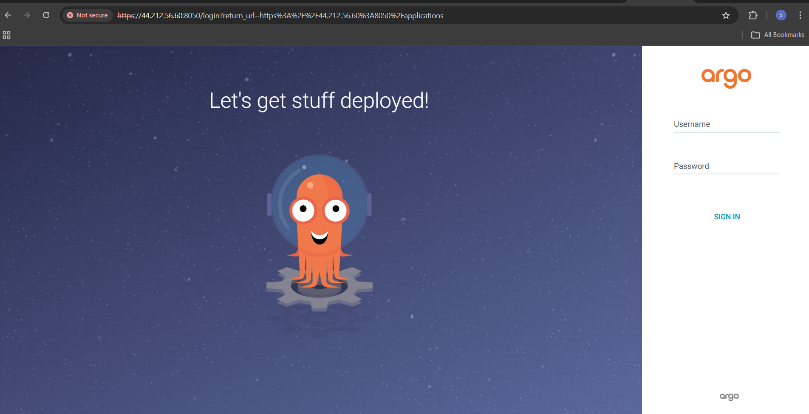

# ✅ After adding app in argocd, your deployment look like: 

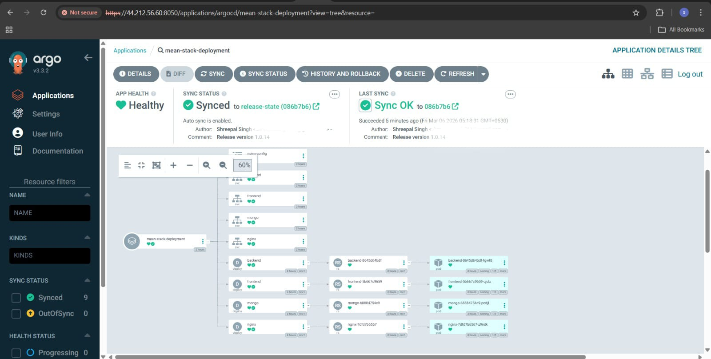


# ✅ Now you can access our application: 

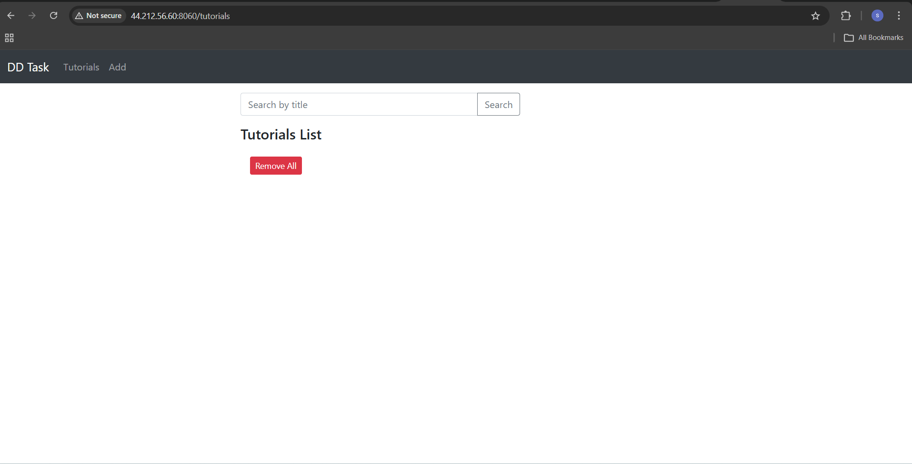


# 🚀 Install and Configure Prometheus & Grafana

---

# 📌 Pre-Requisites

- helm
```bash
curl https://raw.githubusercontent.com/helm/helm/main/scripts/get-helm-3 | bash
helm version
```

## 📦 Prometheus

### Step 1 — Add Prometheus Helm Repo and Update
```bash
helm repo add prometheus-community https://prometheus-community.github.io/helm-charts
helm repo update
```

### Step 2 — Create Monitoring Namespace
```bash
kubectl create ns monitoring
```

### Step 3 — Install Prometheus
```bash
helm install prometheus prometheus-community/prometheus \
  --namespace monitoring
```

### Step 4 — Verify Services
```bash
kubectl get service -n monitoring
```

### Step 5 — Expose Prometheus Server
```bash
kubectl expose service prometheus-server -n monitoring \
  --type=NodePort \
  --target-port=9090 \
  --name=prometheus-server-ext
```

### Step 6 — Port Forward Prometheus
```bash
nohup kubectl port-forward -n monitoring svc/prometheus-server 9090:80 \
  --address 0.0.0.0 > prometheus.log 2>&1 &
```

### Step 7 — Access Prometheus UI
```
http://<EC2-PUBLIC-IP>:9090
```

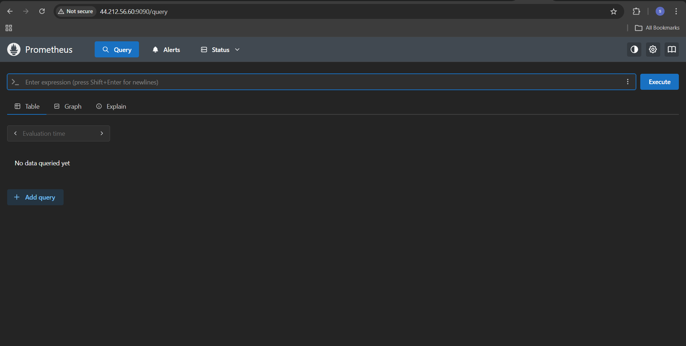


---

## 📊 Grafana

### Step 1 — Add Grafana Helm Repo and Update
```bash
helm repo add grafana https://grafana.github.io/helm-charts
helm repo update
```

### Step 2 — Install Grafana
```bash
helm install grafana grafana/grafana \
  --namespace monitoring
```

### Step 3 — Verify Services
```bash
kubectl get service -n monitoring
```

### Step 4 — Expose Grafana Service
```bash
kubectl expose service grafana -n monitoring \
  --type=NodePort \
  --target-port=3000 \
  --name=grafana-ext
```

### Step 5 — Port Forward Grafana
```bash
nohup kubectl port-forward -n monitoring svc/grafana 3000:80 \
  --address 0.0.0.0 > grafana.log 2>&1 &
```

### Step 6 — Get Grafana Admin Password
```bash
kubectl get secret --namespace monitoring grafana \
  -o jsonpath="{.data.admin-password}" | base64 --decode
```

### Step 7 — Access Grafana UI
```
http://<EC2-PUBLIC-IP>:3000
Username: admin
Password: <output from Step 6>
```

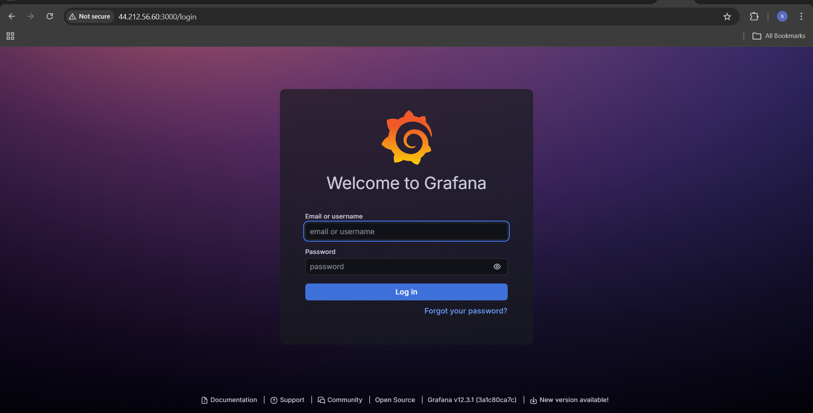

---

## 🔗 Connect Prometheus as Grafana Data Source

1. Login to Grafana
2. Click **Add data source → Prometheus**
3. Set URL to:
```
http://prometheus-server.monitoring.svc.cluster.local
```

5. Click **Save & Test** ✅

---

# ✅ After Adding Dashboard:

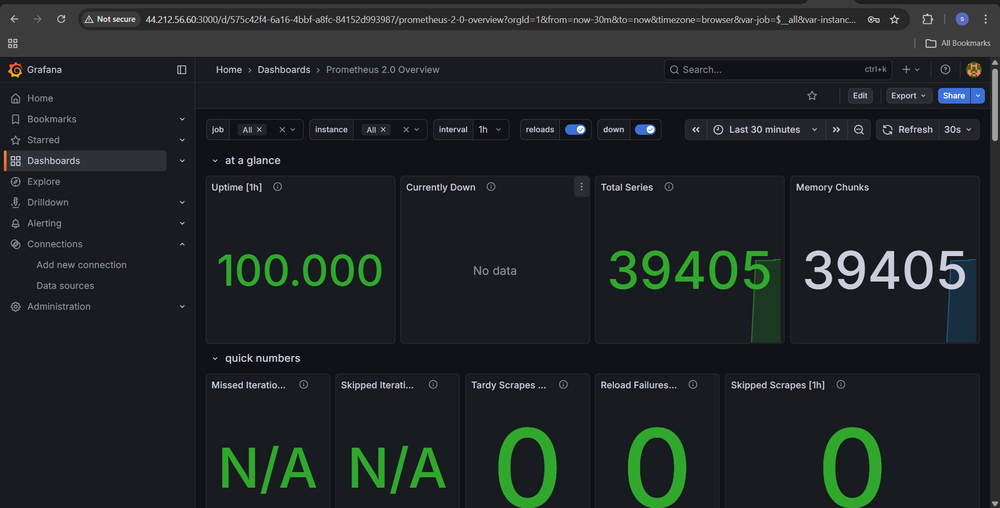


